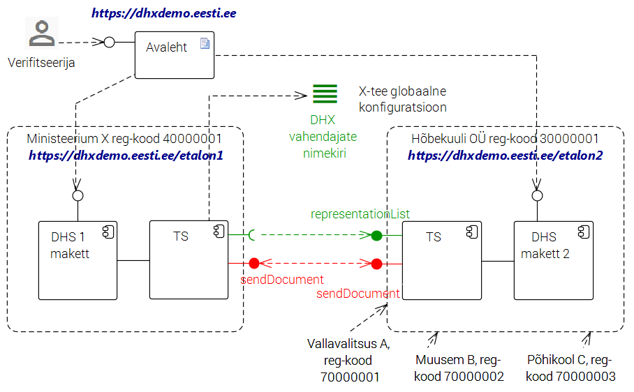

ET / EN

### DHX protokolli etalonteostus

DHX on uus, X-tee v6 omadustele rajatud dokumendivahetusprotokoll, mis võimaldab Eesti avaliku sektori dokumendihaldussüsteemidel vahetada dokumente hajus- e detsentraliseeritud põhimõttel.

Protokolli on välja töötanud Riigi Infosüsteemi Amet.

Etalonteostus demonstreerib DHX protokolli töötamist. Ühtlasi on etalonteostust võimalik kasutada DHX-i võimekusega infosüsteemi testimiseks.

Etalonteostus on loodud projekti ["Dokumendivahetustaristu hajusarhitektuurile üleviimise väljatöötamine"](https://github.com/e-gov/DHX/blob/master/README.md#projekt-dokumendivahetustaristu-hajusarhitektuurile-%C3%BCleviimise-v%C3%A4ljat%C3%B6%C3%B6tamine) raames.

Alljärgnevalt selgitame, kuidas etalonteostust kasutada ja kuidas anda tagasisidet.

####Demonstratsioon

DHX protokolliga tutvujatele, kes soovivad DHX demonstratsiooni, soovitame „läbi mängida“ järgmised kasutuslood: [etalonteostuse kasutusjuhend](https://github.com/e-gov/DHX-etalon/blob/master/files/kasutusjuhend.md) ja [testilood](https://github.com/e-gov/DHX-etalon/blob/master/files/testlood.md).

####Testimine

Arendajatele, kes soovivad DHX teenuse arendamisel kasutada etaloni testimiseks, soovitame kasutada järgmisi abimaterjale: https://github.com/e-gov/DHX/blob/master/docs/Standardtestid.md

Kasutamiseks on saadaval kolm etalonteostuse rakendust. Kõik rakendused on samaväärsed ja on võimelised dokumente saatma ja vastu võtma DHX dokumendivahetusprotokolli järgi. (NB! järgmised lingid nõuavad id kaardiga autentimist!):
Etalonteostuse rakendus 1
Etalonteostuse rakendus 2 
Etalonteostuse rakendus 3

#### Org vaade

#### Tehn vaade

