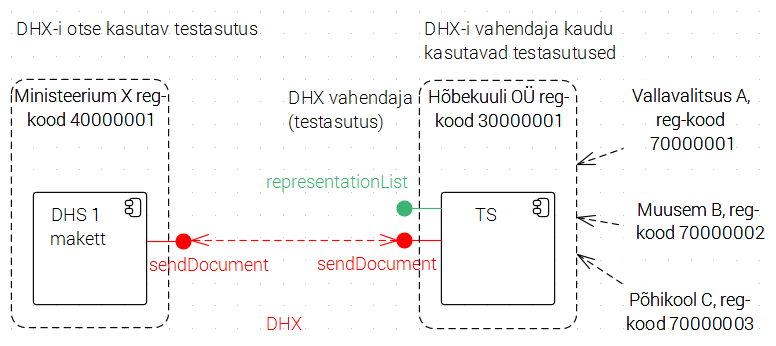

ET / EN

### DHX protokolli etalonteostus 

DHX on uus, X-tee v6 omadustele rajatud dokumendivahetusprotokoll, mis võimaldab Eesti avaliku sektori dokumendihaldussüsteemidel vahetada dokumente hajus- e detsentraliseeritud põhimõttel.

Protokolli on välja töötanud Riigi Infosüsteemi Amet.

Etalonteostuse eesmärk on kontrollida (verifitseerida) protokolli terviklikkust ja teostatavust ning anda "käegakatsutav" tõendusmaterjal protokolli lõplikuks "lukkulöömiseks" vajalike otsuste tegemiseks. Ühtlasi on etalonteostus demonstraatoriks s.t töötavaks mudeliks, mis selgitab protokolli toimimist näitlikus vormis.

Alljärgnevalt selgitame, kuidas etalonteostust kasutada ja kuidas anda tagasisidet.

Etalonteostus on loodud projekti ["Dokumendivahetustaristu hajusarhitektuurile üleviimise väljatöötamine"](https://github.com/e-gov/DHX/blob/master/README.md#projekt-dokumendivahetustaristu-hajusarhitektuurile-%C3%BCleviimise-v%C3%A4ljat%C3%B6%C3%B6tamine) raames.

Kasutamiseks on saadaval kaks etalonteostuse rakendust. Mõlemad rakendused on samaväärsed ja on võimelised dokumente saata ja vastu võtta DHX dokumendivahetusprotokolli järgi.
Etalonteostuse rakendus 1(autentimine ID kaardiga)
Etalonteostuse rakendus 2(autentimine ID kaardiga)

DHX protokolli toimimise verifitseerimiseks ja etalonteostuse rakenduste kasutamise lihtsustamiseks on loodud [etalonteostuse kasutusjuhend](https://github.com/e-gov/DHX-etalon/blob/master/files/kasutusjuhend.md) ja [testilood](https://github.com/e-gov/DHX-etalon/blob/master/files/testlood.md).

Läbi viidud on [Hajusa dokumendivahetuse andmevahetusprotokolli DHX analüüs](https://github.com/e-gov/DHX/raw/master/files/Hajusa_dokumendivahetuse_andmevahetusprotokolli_DHX_anal%C3%BC%C3%BCs_1.2.pdf).

#### Org vaade

#### Tehn vaade

