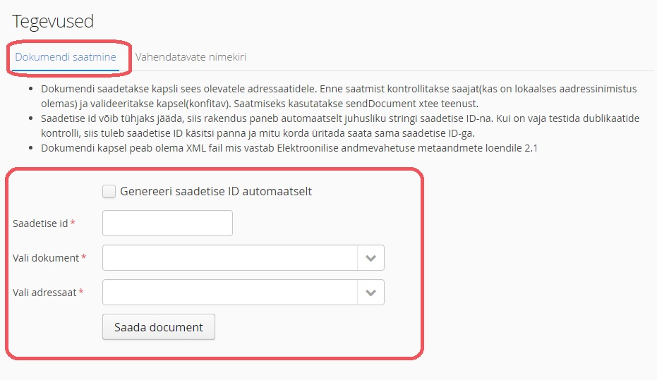
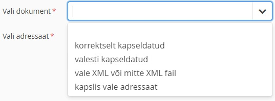
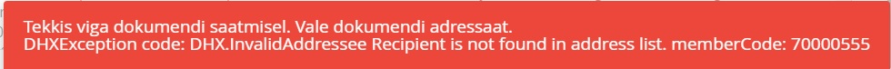
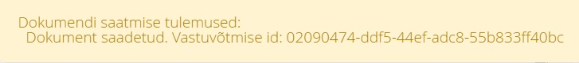
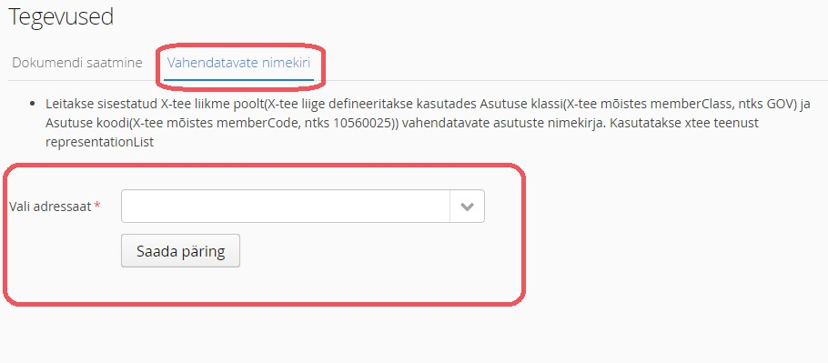
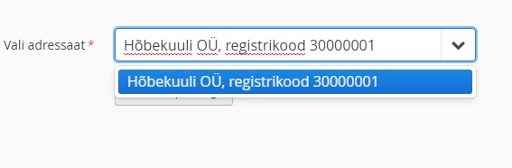
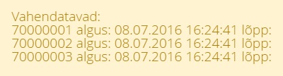
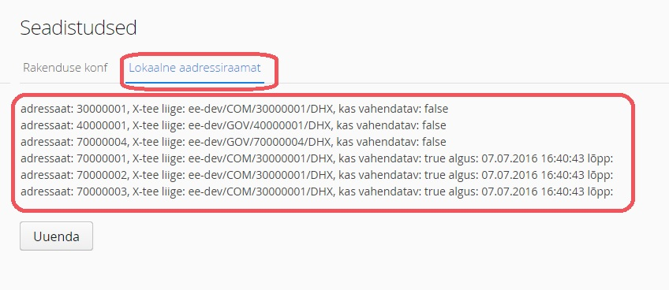
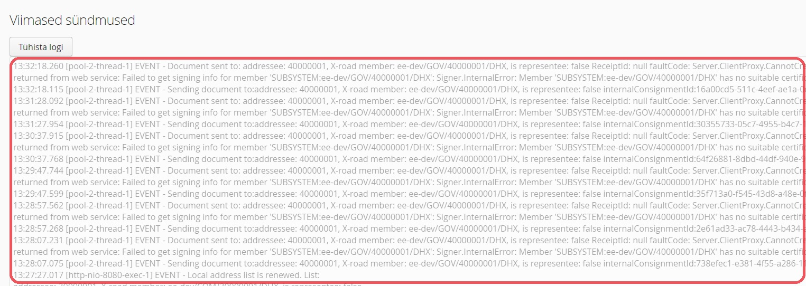
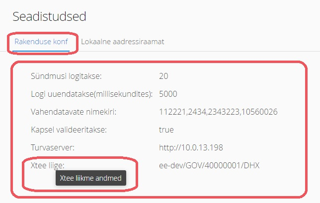

# Etalonteostuse kasutusjuhend

### Sissejuhatus
Antud dokument kirjeldab dokumendivahetusprotokolli DHX etalonteostuse kasutamist. Kirjeldatud on peamine funktsionaalsus koos vajalike sammudega ja ekraanipiltidega.
DHX etalonteostus on programm, mis realiseerib DHX protokolli peamised teenused (sendDocument ja representationList) ning samuti kliendi/saatja funktsionaalsuse (dokumendi saatmiseks teisele asutusele üle X-tee). Etalonteostuse mitu eksemplari on paigaldatud RIA testkeskkonda, selleks et saaks testida dokumendi kapsli saatmist erinavate asutuste vahel.  

### 1. Dokumendi saatmine
Dokumendi saatmisel saadetakse dokumendi kapsel saatja asutuse poolt vastuvõtja asutusele. Saatja asutuse etalonteostuse eksemplar käitub SOAP kliendina. Vastuvõtja asutuse etalonteostuse eksemplar käitub SOAP sendDocument teenusena.

* Kasutavaja valib ’Tegevused’ regioonis ’Dokumendi saatmine’  tab-i.

* Kasutaja täidab saatmiseks vajalikud andmed.

    * Kasutaja eemaldab  märkeruudu  ’Genereeri saadetise ID automaatselt’ valiku, kui soovib saadetise id käsitsi sisestada.
    * Juhul kui valik  ’Genereeri saadetise ID automaatselt’ ei ole valitud, siis kasutaja täidab ’Saadetise id’
    * Kasutaja valib saadetava dokumendi kapsli ’Vali dokument’ rippmenüüst.  
Rippmenüü sisu:

  *Märkus:  ’Kapslis vale adressaat’ kasutatakse, et testida kapsli adressaadi valideerimist. Juhul kui valitud  ’kapslis vale adressaat’, siis järgmises punktis valitud adressaati ignoreeritakse ja ei panda kapslisse, vaid saadetakse vale adressaadiga kapsel.*
  * Kasutaja valib adressaadi ’Vali adressaat’ rippmenüüst. Rippmenüü sisu:
  
  

  *Märkus: Asutus Y on mõeldud veasituatsiooni testimiseks. Asutus Y on olemas X-tees ja on DHX protokolli liige X-tee andmete järgi,  aga tegelikult ei paku vajalikke teenuseid. Asutus Z puudub X-tees ja on mõeldud veasituatsiooni testimiseks. Ülejäänud adressaadid on X-tees olemas ja pakuvad vajalikke teenuseid.*
   
* Kasutaja vajutab  ’Saada dokument’ nupule.
* Süsteem kuvab teate dokumendi saatmise tulemustega brauseri akna allosas.  Vastav info on kajastatud ka ’Sündmuste logis’(vt.  Punkt  5).

##### Teadete näited:
  
* Teade kui tekkis viga:

  
  
* Teade kui dokumendi saatmise õnnestus:

  

### 2. Vahendatavate nimekirja pärimine
DHX vastuvõtja süsteem, mis vahendab dokumente teistele asutustele, peab pakkuma enda poolt vahendatavate asutuste nimekirja leidmise SOAP teenust (representationList). 

* Kasutaja valib ’Tegevused’ regioonis ’Vahendatavate nimekiri’  tab-i.

* Kasutaja täidab saatmiseks vajalikud andmed

    *  Kasutaja valib adressaadi nimekirjast ’Vali adressaat’. Pakutava nimekirja sisu (nimekirjas on ainult vahendaja rollis asutus):
    
  
  
  *Märkus: Asutus Y on mõeldud veasituasiooni testimiseks. Asutus Y on olemas X-tees ja on DHX protokolli liige X-tee andmete järgi, aga tegelikult ei paku vajalikke teenuseid. Asutus Z puudub X-tees ja on mõeldud veasituatsiooni testimiseks. Ülejäänud adressaadid on X-tees olemas ja pakuvad vajalikke teenuseid.*
* Kasutaja vajutab  ’Saada päring’ nupule
* Süsteem kuvab teate päringu tulemustega.  Vastav info on kajastatud ka ’Sündmuste logis’(vt.  Punkt  5)

##### Teadete näited:

* Teade kui viga tekkis saatja süsteemis või saatmisel:

* Teade kui päring  õnnestus:

### 3. Lokaalse aadressinimistu vaatamine ja uuendamine
Lokaalne aadressiraamat on nimekiri kõikidest asutustest, kellele DHX kaudu saab dokumente saata. Aadressiraamat sisaldab kolme liiki kirjeid: DHX otsevõimekusega asutused, vahendatavad asutused ja üleminekuperioodil DVK poolt vahendatavad asutused. Lokaalne aadressiraamat koostatakse DHX protokollis kirjeldatud algoritmi alusel.
* Kasutavaja valib ’Seadistused’ regioonis  ’Lokaalne aadressiraamat’  tab-i.
* Süsteem kuvab lokaalse aadressiraamatu.

  
  *Märkus: lokaalses aadressiraamatus on kirjas adressaat (ehk asutuse registrikood, kellele võib dokumente saata kasutades DHX protokolli), X-tee liige(ehk tegelik X-tee liige kellele saadetakse dokument. X-tee liikme kood võib erineda adressaadi registri koodist, kui tegemist on vahendatava asutusega), kas asutus on vahendatav ja vahendamise algus- ja lõppkuupäevad juhul kui asutus on vahendatav.*
* Kasutaja vajutab ’Uuenda’ nupule.
* Süsteem kuvab teate aadressiraamatu uuendamise õnnestumisest.  Vastav info on kajastatud ka ’Sündmuste logis’(vt.  Punkt  5)
##### Teadete näited:
* Õnnestumise teade:

### 4. Sündmuste logi vaatamine ja tühistamine
* Süsteem kuvab ’Sündmuste logi’ regiooni

  *Märkus:  Sündmuste logis kuvatakse viimaseid süsteemis tekkinud sündmusi. Logisse jõuavad järgmised sündmused: dokumendi saatmine, dokumendi vastuvõtmine,  vahendatavate listi pärimine,vahendatavate listi tagastamine, aadressi listi koostamine (uuendamine). Iga sündmuse kohta logitakse järgmised andmed: sündmuse toimumise kellaaeg (ntks: 13:33:53.905), sündmuse kirjeldus (inglise keelne sündmuse kirjeldus koos sisend/väljund parameetritega, ntks: Sending document to:addressee: 40000001, X-road member: ee-dev/GOV/40000001/DHX, is representee: false internalConsignmentId:b17cdacd-60c6-412b-9a4c-5f2c3edb3095)*
* Kasutaja vajutab ’Tühista logi’ nupule.
* Süsteem tühistab sündmuste logi (kuvatakse tühja logi).

###  5. Rakenduse konfiguratsiooni vaatamine
* Kasutavaja valib ’Seadistused’ regioonis  ’Rakenduse konf’  tab-i.
* Süsteem kuvab rakenduse konfiguratsiooni.

  *Märkus: iga konfiguratsiooni parameetri nimele hiirega peale minnes kuvatakse selle parameetri sisu selgitav tekst*