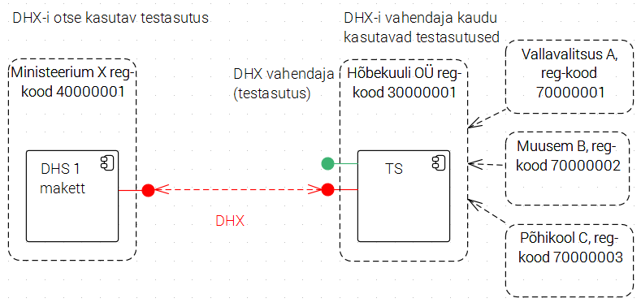
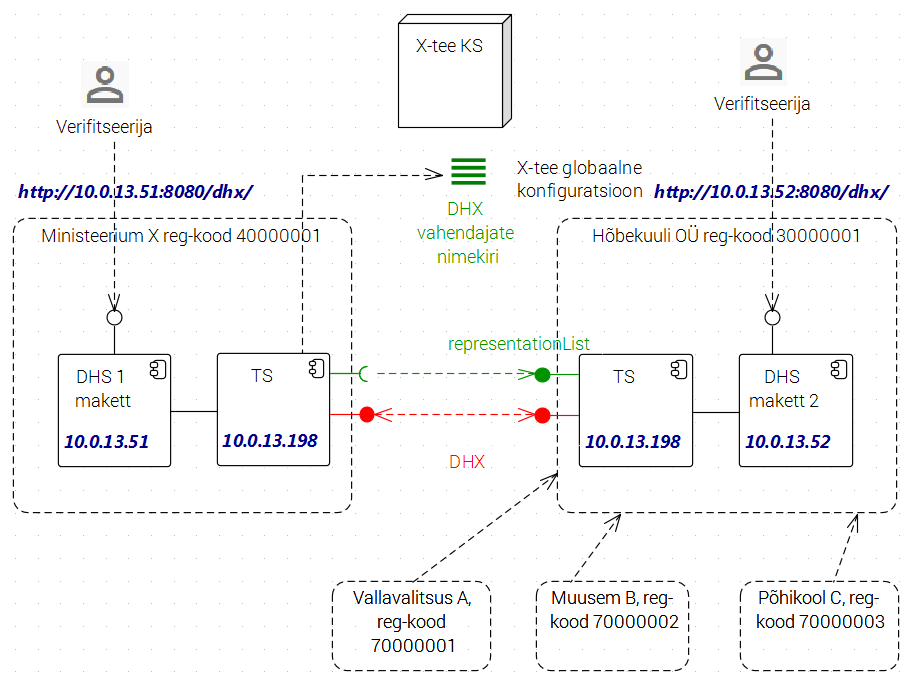
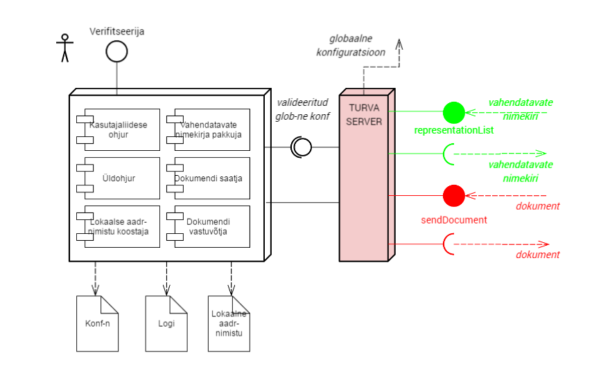

# Etalonteostuse spetsifikatsioon
Vt ka [Etalonteostuse testiplaan](https://github.com/e-gov/DHX-etalon/blob/master/files/testlood.md).
### Ülevaade
Etalonteostuses demonstreeritakse DHX protokolli olulisi jooni ja kontrollitakse nende teostatavust.
Etalonteostuses kasutatakse ettevalmistatud ["Etalonteostuse testandmed"](https://github.com/e-gov/DHX-etalon/blob/master/files/testandmed.md) (vt joonis 1).

Joonis 1  Kontseptuaalne vaade

DHX etalonteostuse tarkvara koosneb makettrakendusest koos juurdekuuluvate käitlusandmetega ja dokumentatsiooniga.

Makettrakendus, edaspidi ka makett:

  1. paigaldatakse omaette (virtuaal)masinasse;
  2. omab inimkasutaja liidest, mille kaudu etalonteostuse verifitseerija saab veenduda, et dokumendivahetus tõesti toimib protokollikohaselt;
  3. on konfigureeritav konfiguratsioonifaili abil;
  4. pakub ja tarbib X-teel teenuseid (sendDocument ja representationList);
  5. logib oma toiminguid;
  6. teostatakse Javas.
Etalonteostuses tuleb teostada dokumendi saatmine ja vastuvõtmine, samuti DHX-i vahendamisega seonduv (vt DHX dokumendivahetusteenuse vahendamine). Makettrakendus projekteeritakse ja teostatakse tööna nr 2, vt 2. Tööde kirjeldus RIA.

### Mõisted
* globaalne konfiguratsioon - X-tee keskserveri poolt pakutav XML fail, mis sisaldab X-tee liikmete, alamsüsteemide ja gruppide nimekirju (vt PR-GCONF X-Road: Protocol for Downloading Configuration).
* saatmistoiming - dokumendi saatmine DHX protokolli kasutades
* vastuvõtutoiming - dokumendi vastuvõtmine DHX protokolli kasutades
* saadetis - üks või mitu dokumendivahetuse kapslisse paigutatud faili
* DHX-i otserakendamine - DHS-i toimimine DHX dokumendivahetuses X-teel oma nime all, oma serti kasutades
* DHX-i vahendamine - DHX dokumendivahetuse pakkumine teenusepakkuja - vahendaja - poolt
* makettrakendus - edaspidi ka makett - DHS-i toimimist imiteeriv rakendus, mille ülesanne on demonstreerida ja testida DHX protokolli teostatavust ja ärinõuetele vastavust

### Paigaldamine
* Makettrakendus paigaldatakse kahes instantsis (vt joonis 2): paigaldusplaani joonisel tähistatud "DHS makett 1" ja "DHS makett 2".
* Üks instants (DHS makett 1) pannakse üles DHX-i otserakendavana
* Teine instants peab toimima DHX-i vahendajana
* See, kas instants toimib vahendajana või mitte, määratakse konfiguratsioonifailis.

Joonis 2  Tehniline paigaldusplaan

### Käitamine
* Makettrakendusele ei tehta eraldi teste, vaid kavandatakse makettrakenduse käitustegevused. (Käitamine ongi testimine). Käitustegevustest osa automatiseeritakse; osa teeb inimkasutaja,
* Inimkasutaja tegevused:
  1. käivitab nupuvajutusega dokumendi saatmise
  2. vaatleb kasutajaliideses, kuidas dokumendid liiguvad (saatmiste ja vastuvõtmiste jm oluliste sündmuste logi esitamine reaalajas)
  3. vaatab varasemate toimingute ja oluliste sündmuste logi
  4. muudab dokumentide automaatse saatmise regulaarsust
  5. käivitab nupuvajutused lokaalse aadressinimekirja koostamise
* Automatiseeritud tegevused:
  1. dokumendi saatmine konfiguratsioonifailis etteantud regulaarsusega (kasutaja saab seda muuta)
  2. lokaalse aadressinimekirja koostamine konfiguratsioonifailis etteantud regulaarsusega.

### Arhitektuuridiagramm

Joonis 3  Makettrakenduse arhitektuuridiagramm

### Funktsionaalsus

##### 1.  Maketi üldohjamine	
* Konfiguratsioonifaili sisselugemine maketi käivitamisel ja tööparameetrite seadistamine
* Makettrakendus peab logima kõik olulised toimingud ja sündmused
* Logi kasutatakse etalonteostuse raportina (testiraportina)
* Tõrgete logimine vastavalt üldistele logimisnõuetele
* Logimisraamistikuks SLF4J

##### 2.  Dokumendi saatmine
* Dokumendi sisu ei ole etalonteostuses oluline
* Dokument tuleb panna kapslisse
 
* Vahendaja ülesleidmine lokaalsest aadressiraamatust
* Dokumendi lähetamine vastavalt DHX-i toimimisreeglile [Märkus. DHX-i protokolli tuleb täiendada vahendamiskihist DHX dokumendivahetusteenuse vahendamine tulenevaga.]

##### 3.  Dokumendi vastuvõtmine	
* Vastuvõtmine tuleb logida
* Kui vastuvõtja on DHX-i vahendaja, siis tuleb dokumendi kapslist leida adressaadi registrikood
* Vahendaja poolt vastuvõetud dokumendi saatmist adressaadi DHS-i makett ei teosta

##### 4.  Toimingute kuvamine inimkasutajale	
* Inimkasutaja näeb kasutajaliideses, kuidas dokumendid liiguvad (saatmiste ja vastuvõtmiste jm oluliste sündmuste logi esitamine reaalajas)
* Samuti võimalik vaadata varasemate toimingute ja oluliste sündmuste logi

##### 5. Lokaalse aadressinimistu koostamine	

Lokaalne aadressinimekiri on adresseerimiseks kasutatav, DHX-i rakendava DHS-i poolt koostatav ja puhvrina kasutatav nimekiri:
* DHX-i otsekasutajatest
* DHX-i vahendajatest ja vahendatavatest asutustest.

Lokaalse aadressinimekirja struktuur
* koosneb kirjetest. Iga kirje kirjeldab ühe DHX-i - kas otse või vahendaja kaudu - kasutava adressaadi.

Lokaalse aadressinimekirja koostamise algoritm:
1. loeb turvaserverist globaalse konfiguratsiooni (XML-faili) [1]
2. LOKAALNE_AADRESSINIMEKIRI = [].
3. leiab DHX-i vahendaja kaudu kasutavad asutused
  1. leiab globaalse konfiguratsiooni failist grupi DHX vahendajad  liikmete nimekirja
  2. iga grupi DHX vahendajad  liikmega (vahendajaga):
    1. pärib vahendaja teenuselt representationList vahendatavate asutuste nimekirja
    2. iga nimekirja kirjega:
      1. lisab kirje nimekirja LOKAALNE_AADRESSINIMEKIRI.
4. leiab DHX-i otse kasutavad asutused
  1. käib läbi globaalse konfiguratsiooni faili ja iga liikme, korral, kellel on nimega DHX alamsüsteem
    1. lisab registrikoodi ja nimetuse nimekirja LOKAALNE_AADRESSINIMEKIRI.
5. kui maketi konfiguratsioonis on nii määratud, siis salvestab nimekirja.

Salvestatud lokaalse aadressinimekirja mällulugemine

Lokaalset aadressinimekirja hoitakse mälus ja kasutatakse dokumentide väljasaatmisel (adresseerimisel).

Maketi käivitamisel:

IF maketi konfiguratsioonis on nii määratud, THEN

loetakse salvestatud nimekiri mällu.
kui lugemine ebaõnnestub või nimekiri on aegunud, siis
värskendatakse nimekirja (koostatakse uuesti) [PROBLEEM: Globaalse konfiguratsiooni aegumistähtaeg - expire-date - on allkirjas, TS eemaldab selle. Värskendamine on seetõttu problemaatiline].
ELSE
koostatakse nimekiri

Tehnilised üksikasjad: globaalse konfiguratsiooni võtmine

* Makett võtab globaalse konfiguratsiooni turvaserverist.
* Turvaserver laeb avalikult publitseeritud aadressilt alla globaalse konfiguratsioon, valideerib seda (globaalne konfiguratsioon on allkirjastatud) ja salvestab oma kasutuseks fail. Fail on kättesaadav aadressilt aadressilt http://SECURITYSERVER/verificationconf, kus SECURITYSERVER on turvaserveri aadress. Nimetatud aadressilt pakutakse faili nimega shared.params.xml. Vt UG-SIGDOC X-Road: Signed Document Download and Verification Manual http://x-road.eu/docs/x-road_signed_document_download_and_verification_manual.pdf jaotis 3.2.
* Globaalse konfiguratsiooni koosseisu ja vormingu kohta vt PR-GCONF X-Road: Protocol for Downloading Configuration http://x-road.eu/docs/x-road_protocol_for_downloading_configuration.pdf - X-tee globaalse konfiguratsiooni protokoll.
* nimekirja hoitakse mälus.

##### 6.  Vahendatavate nimekirja pakkumine X-tee teenusena
* Vt [representationList teenuse spetsifikatsioon](https://github.com/e-gov/DHX/blob/master/files/representationList.md).

* X-tee teenuse nimi on representationList
* Päring on tühi; vastuses on loend vahendatavate asutuste registrikoodidest
* Registrikoodid tuleb ette anda makettrakenduse konfiguratsioonifailis

##### 7. Üldvormistus	
* Üheleherakendus (single-page application)
* Pealkiri: "Dokumendivahetusprotokolli DHX etalonteostus"
* Alapealkiri: projekt "Dokumendivahetustaristu hajusarhitektuurile üleviimise väljatöötamine"
  * Riigi Infosüsteemi Amet, 2016
* Struktuuritoetuste logo, vt https://github.com/e-gov/DHX
* Lühitutvustus:
  * DHX on uus, X-tee v6 omadustele rajatud dokumendivahetusprotokoll, mis võimaldab Eesti avaliku sektori dokumendihaldussüsteemidel vahetada dokumente hajuspõhimõttel. [Protokoll](https://github.com/e-gov/DHX) on kavandi staatuses.
  * Etalonteostus on töötav mudel (proof of concept, demonstraator), kus on realiseeritud kõik protokolli terviklikkuse ja teostatavuse tõendamiseks ja hindamiseks olulised aspektid.
  * Lühitutvustus peaks olema konfiguratsioonis muudetav html tekst.
* Vastavalt makettrakendusele:
  * Ministeerium X, registrikood 40000001 Dokumendihaldussüsteem (DHS)
või
  * Hõbekuuli OÜ, registrikood 30000001 Dokumendihaldussüsteem (DHS)
  
##### 8. Kuva elementide seletused	
* Kuval olevad elemendid vajavad seletamist. Iga elemendi (nt "Sündmusi logitakse:" kõrvale tuleks panna "?" nupuke, millele vajutamisel avaneks väike seletav tekst. Need tekstid peaksid olema rakenduse konfiguratsioonis seatavad.

##### 9. Terminoloogia	
* Kasutada tuleks täpselt protokolli terminoloogiat. Eesti keel, vajaduse korral inglise keel paralleelselt.
* Consignment - eestikeelne vaste on saadetis

##### 10. Testasutused	
* Kasutame [Etalonteostuse testandmetes](https://github.com/e-gov/DHX-etalon/blob/master/files/testandmed.md) määratletud asutusi.

##### 11. Testdokumendid	
* Kasutame lehel [Etalonteostuse testandmed ](https://github.com/e-gov/DHX-etalon/blob/master/files/testandmed.md) olevaid dokumente, neid vajadusel muutes.

##### 12. Veakäsitlus	
* Makettrakendused ei tohi ühelgi juhul väljastada Java stack-i. Veaolukorrad tuleb kinni püüda ja esitada eestikeelsete teadetena.

### Kasutajaliides
Testide läbiviimisel peamised elemendid:

* rippmenüü Vali dokument, valikutega:
  * korrektselt kapseldatud
  * valesti kapseldatud
  * vale XML või mitte XML fail
  * kapslis vale adressaat
* rippmenüü Vali adressaat, valikutega:
  * Ministeerium X, registrikood 40000001
  * Hõbekuuli OÜ, registrikood 30000001
  * Vallavalitsus A, registrikood 70000001
  * Muusem B, registrikood 70000002
  * Põhikool C, registrikood 70000003
  * Asutus Y, registrikood 70000004
  * Asutus Z
* väli Saadetise ID (Consignment ID). (Kõrval märkus, et kui jäetakse tühjaks, siis süsteem genereerib ise).
* nupp Saada dokument
* nupp Uuenda lokaalset aadressinimistut
* sündmuste logi
* vahendusnimekiri (kui on tegu vahendajaga)